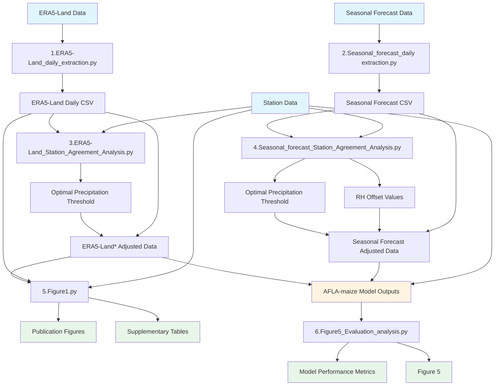

# balkova-et-al-2026-scripts
**Code accompanying:** Balková, D., Raj, R., Rieder, H. E., Camardo Leggieri, M., & Battilani, P. (2026). Predicting aflatoxin risk with seasonal meteorological forecast. *Environmental Research Letters*. https://doi.org/10.1088/1748-9326/ae3629

**How to cite this repository:**
darinabalkova. (2026). darinabalkova/balkova-et-al-2026-scripts: Initial release v1.0.0 (v1.0.0). Zenodo. https://doi.org/10.5281/zenodo.18247147

This repository contains Python scripts for preprocessing climate data, evaluating agreement between reanalysis/forecast data and station observations, and evaluating model performance. The scripts support the analysis workflow described in the associated publication.

## Overview

The scripts in this repository perform the following tasks:
1. **Data Extraction and Preprocessing**: Extract and preprocess ERA5-Land and seasonal forecast data from NetCDF files
2. **Agreement Analysis**: Compare reanalysis/forecast data with station observations to determine optimal thresholds and bias adjustment
3. **Visualization**: Generate figures comparing different data sources
4. **Model Evaluation**: Evaluate model outputs (AFI_max) from the AFLA-maize model

## Workflow Diagram

The following diagram shows the chronological workflow of the analysis scripts:



## Scripts Description

### 1. Data Extraction and Preprocessing

#### `1.ERA5-Land_daily_extraction.py`
**Purpose**: Extracts daily meteorological data from ERA5-Land NetCDF files for specific grid cells.

**Inputs**:
- ERA5-Land NetCDF files (from Copernicus CDS)
- Grid cell coordinates (latitude, longitude) for 10 stations

**Outputs**:
- `ERA5_Land_Daily_Extracted_All_Years.csv`: Daily data (T, RH, P) for all years and locations

**Key Features**:
- Extracts data for predefined grid cells matching station locations
- Calculates daily mean temperature from max/min
- Handles multiple years of data

---

#### `2.Seasonal_forecast_daily extraction.py`
**Purpose**: Extracts and preprocesses seasonal forecast data from NetCDF files, including altitude correction.

**Inputs**:
- Seasonal forecast NetCDF files (from Copernicus CDS)
- Forecast orography NetCDF file
- ERA5-Land geopotential NetCDF file
- Target grid cell coordinates

**Outputs**:
- CSV files with preprocessed forecast data (T, RH, P) for each forecast initiation month

**Key Features**:
- Extracts data from NetCDF files
- Calculates daily mean temperature, relative humidity, and precipitation
- Applies altitude correction using lapse rate (0.0065 °C/m)
- Handles multiple ensemble members and calculates ensemble mean

**Note**: Requires orography files for altitude correction. The script uses the difference between forecast and ERA5-Land orography to correct temperature values.

---

### 2. Agreement Analysis

#### `3.ERA5-Land_Station_Agreement_Analysis.py`
**Purpose**: Compares ERA5-Land data with station observations to determine optimal precipitation threshold and generate agreement metrics.

**Inputs**:
- CSV file with Station and ERA5-Land data (columns: Date, Location, T, RH, P, DATA)

**Outputs**:
- `Summary_Table_Full_Period.csv`: Agreement metrics for full period (2008-2025)
- `Summary_Table_Growing_Season.csv`: Agreement metrics for growing season only
- `Precip_Filtering_All_Thresholds.csv`: Results for all tested thresholds
- `Precip_Filtering_Best_Thresholds.csv`: Optimal threshold recommendations
- Optimal precipitation threshold recommendation (printed to console)

**Key Features**:
- Calculates agreement metrics for T, RH, P
- Tests multiple precipitation thresholds (1.0-5.0 mm, 0.5 mm increments)
- Analyzes full period and growing season separately
- Suggests optimal threshold for creating ERA5-Land* (filtered data)

**Note**: The optimal threshold is used to create ERA5-Land* by filtering precipitation values below the threshold.

---

#### `4.Seasonal_forecast_Station_Agreement_Analysis.py`
**Purpose**: Compares seasonal forecast data (ensemble mean) with station observations to determine optimal precipitation thresholds and RH offsets.

**Inputs**:
- Forecast CSV files (one per initiation month: April, June, July, August)
- Station CSV file with observations

**Outputs**:
- Summary tables with agreement metrics per forecast initiation month
- Optimal precipitation threshold recommendations (by grid)
- RH bias summary (by initiation month and grid)
- Aggregated comparison tables for grids with multiple stations
- Supplementary tables for forecast evaluation

**Key Features**:
- Processes multiple forecast files (different initiation months)
- Analyzes growing season months only (varies by initiation month)
- Tests precipitation thresholds (1.0-10.0 mm, 0.5 mm increments)
- Calculates RH bias/offset for potential correction
- Handles grids with multiple stations (aggregates station data)

**Note**: RH offset values are reported but should be applied carefully, as biases may vary by location and seasonal conditions.

---

### 3. Visualization

#### `5.Figure1.py`
**Purpose**: Generates figures (Figure 1) and supplementary tables (Supplementary Figure 3) comparing Station, ERA5-Land, and ERA5-Land* data.

**Inputs**:
- Merged CSV file with Station, ERA5-Land, and ERA5-Land* data

**Outputs**:
- `Figure1_Final_Analysis_[Location]_[Year].png`: Main figure with climatology, bias distribution, and frequency analysis
- `FullTimeSeries_2008-2025_[Location].png`: Full time series plots for each location
- `Supplementary_Table_Statistical_Comparison.csv`: Statistical metrics (full season)
- `Supplementary_Table_Statistical_Comparison_GrowingSeason_Only.csv`: Statistical metrics (growing season only)
- `Grid_Localization_Table.csv`: Station locations and corresponding grid cells

**Key Features**:
- Creates 3x3 panel figures per location and year
- Calculates correlation, RMSE, MAE, MB for T, RH, P
- Generates monthly climatology plots
- Analyzes frequency of extreme events (hot days, high RH days, rainy days)
- Handles 10 different locations

---

### 4. Model Evaluation

#### `6.Figure5_Evaluation_analysis.py`
**Purpose**: Evaluates model performance by analyzing AFI_max (Aflatoxin Index) outputs from the AFLA-maize model across all years (outputs available in supplementary material).

**Inputs**:
- `AFI_Max_Summary_Table.csv`: Summary file with AFI_max values from AFLA-maize model runs
  - Contains results for: Station, ERA5-Land*, and Seasonal Forecasts (April, June, July, August)
  - CSV format with columns: location, year, forecast_timing, run_type, afi_max - see Data Format Requirements below

**Outputs**:
- `Figure5_Performance_Heatmap_AllSites_Stacked.png` (and `.pdf`): Main performance heatmap
- `Figure6_AFI_Max_Summary_Table_AllSites_Stacked.png`: AFI summary visualization
- `Figure6_AFI_Max_Summary_Table_[Location].png`: Per-location AFI summaries
- `AFI_Max_Summary_Table_AllSites.csv`: Summary table with all AFI values
- `contingency_metrics_table_AllSites.png`: Performance metrics visualization
- `Performance_Metrics_Summary.csv`: Detailed performance metrics (TP, TN, FP, FN)

**Key Features**:
- Calculates True Positive, True Negative, False Positive, False Negative rates
- Evaluates performance against Station results AFI threshold (95.0)
- Compares multiple models: ERA5-Land*, Forecast April, Forecast June, Forecast July, Forecast August
- Generates visualizations

**Important Note**: 
This script requires outputs from the **AFLA-maize model** (Battilani et al., 2013). The `AFI_Max_Summary_Table.csv` file with AFI_max outputs is available in the supplementary material (Supplementary Figure 5) and in this repository.

**AFLA-maize model reference**: Battilani, P., Camardo Leggieri, M., Rossi, V., & Giorni, P. (2013). AFLA-maize, a mechanistic model for Aspergillus flavus infection and aflatoxin B1 contamination in maize. *Computers and Electronics in Agriculture*, 94, 38-46. https://doi.org/10.1016/j.compag.2013.03.005

To generate your own input CSV file, users must:
1. Run the AFLA-maize model with climate data inputs (Station, ERA5-Land*, and Seasonal Forecasts)
2. Extract AFI_max values from model outputs
3. Format the results into the required CSV format (see Data Format Requirements below)

The AFLA-maize model code is available upon request from the corresponding author. Please contact paola.battilani@unicatt.it for access to the model scripts.

---

## Important Manual Steps

This workflow includes several manual steps that are required before running certain scripts:

### Manual Step 1: Merge Station and ERA5-Land Data (Before Script 3)

**When**: After running Script 1, before running Script 3

**What to do**:
1. Combine your Station observation data with the `ERA5_Land_Daily_Extracted_All_Years.csv` output from Script 1
2. Ensure the merged CSV contains:
   - `Date (dd/mm/yyyy)` or `Date`: Date column in dd/mm/yyyy format
   - `Location`: Location identifier (station name or grid coordinates)
   - `T (°C)`: Temperature in Celsius
   - `RH (%)`: Relative humidity as percentage
   - `Rain (mm)`: Precipitation in millimeters
   - `DATA`: Source column with values `'Station'` or `'ERA5-Land'` to distinguish data sources
3. Ensure dates and locations match between Station and ERA5-Land data
4. Save the merged file (e.g., `2008-2025_All_station_Era5_Era5c.csv`)

**Why**: Script 3 requires both Station and ERA5-Land data in a single file to compare them.

### Manual Step 2: Apply Optimal Threshold to Create ERA5-Land* (After Script 3)

**When**: After running Script 3, before running Script 5 or model evaluation

**What to do**:
1. Review the optimal precipitation threshold recommended by Script 3 (e.g., 2.0 mm)
2. Take your original ERA5-Land data (`ERA5_Land_Daily_Extracted_All_Years.csv`)
3. Filter precipitation values:
   - Set all `Rain (mm)` values below the optimal threshold to 0 (or NaN)
   - Keep all other variables (T, RH) unchanged
4. Save the filtered data as a new file (e.g., `ERA5_Land_Daily_Extracted_All_Years_filtered.csv`)
5. This filtered data is called "ERA5-Land*" and will be used in subsequent analysis

**Why**: The threshold filtering improves agreement with station observations by removing inflated low precipitation values. 

### Manual Step 3: Merge All Data Sources for Visualization (Before Script 5)

**When**: After creating ERA5-Land* data, before running Script 5

**What to do**:
1. Combine Station, ERA5-Land (original), and ERA5-Land* (filtered) data into a single CSV
2. Include a `DATA` column with values: `'Station'`, `'ERA5-Land'`, or `'ERA5-Land*'`
3. Ensure all data sources have matching dates and locations
4. Save the merged file (e.g., `2008-2025_All_station_Era5_Era5c.csv`)

**Why**: Script 5 requires all three data sources in one file to generate comparison figures.

---

## Data Format Requirements

### Station and ERA5-Land Data Format
CSV file with the following columns:
- `Date` (format: dd/mm/yyyy)
- `Location`: Station name
- `T (°C)`: Temperature in Celsius
- `RH (%)`: Relative humidity in percent
- `Rain (mm)`: Precipitation in millimeters
- `LW (h)`: Leaf wetness duration in hours
- `DATA`: Data source identifier (e.g., "Station", "ERA5-Land", "ERA5-Land*")

### Forecast Data Format
CSV file with the following columns:
- `Date` (format: dd/mm/yyyy)
- `Ensemble_Member`: Ensemble member number (0-50)
- `Location`: Grid cell identifier (format: "lat,lon", e.g., "45,9")
- `T (°C)`: Temperature in Celsius
- `RH (%)`: Relative humidity in percent
- `Rain (mm)`: Precipitation in millimeters
- `LW (h)`: Leaf wetness duration in hours

### AFLA-maize Output Format (for Script 6)
CSV file with the following columns:
- `location`: Station name (e.g., "Castel San Giovanni", "Caorso", "Roncopascolo")
- `year`: Year (integer, e.g., 2008, 2009, ..., 2025)
- `forecast_timing`: Forecast timing with values:
  - `"April"` for April forecast
  - `"June"` for June forecast
  - `"July"` for July forecast
  - `"August"` for August forecast
- `run_type`: Data source identifier with values:
  - `"Station"` for station observations
  - `"ERA5-Land*"` for ERA5-Land filtered data
  - `"Forecast_Mean"` for forecast ensemble mean
- `afi_max`: AFI_max value (float)

**Example structure:**
```
location,year,forecast_timing,run_type,afi_max
Castel San Giovanni,2008,April,Station,18.63129178
Castel San Giovanni,2008,April,ERA5-Land*,42.41304544
Castel San Giovanni,2008,April,Forecast_Mean,33.24341818
Castel San Giovanni,2008,June,Station,18.63129178
Castel San Giovanni,2008,June,ERA5-Land*,42.41304544
Castel San Giovanni,2008,June,Forecast_Mean,52.14485463
...
```

**Note**: 
- The `AFI_Max_Summary_Table.csv` file is available in the supplementary material and in this repository.
- The script reads this CSV format directly - no data transformation needed.

---

## Setup Instructions

### Prerequisites

1. **Python 3.7+** (recommended: Python 3.8 or higher)

2. **Required Python packages** (see `requirements.txt`):
   - pandas
   - numpy
   - xarray
   - matplotlib
   - seaborn
   - scipy
   - scikit-learn
   - h5netcdf (for NetCDF file reading)

3. **Data Sources**:
   - ERA5-Land data: Available from [Copernicus CDS](https://cds.climate.copernicus.eu/)
   - Seasonal Forecast data: Available from [Copernicus CDS](https://cds.climate.copernicus.eu/)
   - Station observations: User-provided
   - Orography files: Available from [Copernicus CDS](https://cds.climate.copernicus.eu/)
     - Forecast orography NetCDF file
     - ERA5-Land geopotential NetCDF file

4. **AFLA-maize Model** (for Figure5 script):
   - The AFLA-maize model is required to generate the input CSV file
   - Model code is available upon request from the corresponding author (paola.battilani@unicatt.it)

### Installation

1. Clone or download this repository

2. Install required packages:
   ```bash
   pip install -r requirements.txt
   ```

3. Configure script paths:
   - Open each script and update the path placeholders (e.g., `PATH_TO_SEASONAL_FORECAST_NETCDF_FILES`)
   - Replace with your actual file paths

4. Ensure data files are in the correct format (see Data Format Requirements above)

---

## Usage Instructions

### Step 1: Data Extraction

1. **Extract ERA5-Land data**:
   ```bash
   python "1.ERA5-Land_daily_extraction.py"
   ```
   - Update `era5_base_dir` in the script to point to your NetCDF files
   - Output: `ERA5_Land_Daily_Extracted_All_Years.csv`

2. **Preprocess Seasonal Forecasts**:
   ```bash
   python "2.Seasonal_forecast_daily extraction.py"
   ```
   - Update paths for NetCDF files and orography files
   - Output: CSV files for each forecast initiation month

### Step 2: Prepare Merged Data for Agreement Analysis

**Before running Script 3, you need to merge your Station data with the ERA5-Land data from Script 1.**

1. **Merge Station and ERA5-Land data** (manual step):
   - Combine your Station data CSV with the `ERA5_Land_Daily_Extracted_All_Years.csv` from Script 1
   - The merged CSV must contain the following columns:
     - `Date (dd/mm/yyyy)` or `Date`: Date in dd/mm/yyyy format
     - `Location`: Location identifier (e.g., station name or grid coordinates)
     - `T (°C)`: Temperature in Celsius
     - `RH (%)`: Relative humidity as percentage
     - `Rain (mm)`: Precipitation in millimeters
     - `DATA`: Source identifier - must be `'Station'` or `'ERA5-Land'` to distinguish data sources
   - Ensure both Station and ERA5-Land data have matching dates and locations
   - Save the merged file (e.g., `2008-2025_All_station_Era5_Era5c.csv`)

### Step 3: Agreement Analysis

1. **Analyze ERA5-Land vs Station agreement**:
   ```bash
   python "3.ERA5-Land_Station_Agreement_Analysis.py"
   ```
   - Update `INPUT_FILE` to point to your merged Station-ERA5 CSV (created in Step 2)
   - Output: Summary tables and optimal precipitation threshold recommendation
   - **Note**: The script will suggest an optimal threshold (e.g., 2.0 mm) based on agreement metrics

2. **Apply optimal threshold to create ERA5-Land* data** (manual step):
   - Review the optimal threshold recommendation from Script 3 output
   - Create ERA5-Land* data by filtering the ERA5-Land data:
     - Set all precipitation values below the optimal threshold to 0 (or NaN)
     - Keep all other variables (T, RH) unchanged
   - Save the filtered data as a new CSV file (e.g., `ERA5_Land_Daily_Extracted_All_Years_filtered.csv`)
   - This ERA5-Land* data will be used in subsequent analysis (Script 5 and model runs)

3. **Analyze Seasonal Forecast vs Station agreement**:
   ```bash
   python "4.Seasonal_forecast_Station_Agreement_Analysis.py"
   ```
   - Update `FORECAST_FILES` to point to the CSV files from Script 2 (e.g., `SF_042008-2025_daily.csv`)
   - Update `STATION_FILE` to point to your Station data CSV file
   - Output: Summary tables, optimal precipitation thresholds, and RH offset values
   - **Note**: The script will suggest optimal thresholds and RH offsets for each forecast initiation month

### Step 4: Visualization

1. **Prepare merged data for visualization** (manual step):
   - Merge Station, ERA5-Land, and ERA5-Land* data into a single CSV file
   - Include a `DATA` column indicating the source: `'Station'`, `'ERA5-Land'`, or `'ERA5-Land*'`
   - Ensure all data sources have matching dates and locations
   - Save the merged file (e.g., `2008-2025_All_station_Era5_Era5c.csv`)

2. **Generate Figure 1 and supplementary tables**:
   ```bash
   python "5.Figure1.py"
   ```
   - Update `MERGED_DATA_FILE` to point to your merged data file (created above)
   - Output: Figures and supplementary tables

### Step 5: Model Evaluation

1. **Run AFLA-maize model** (external step):
   - Use Station, ERA5-Land* (from Step 3), and Seasonal Forecast data (from Script 2) as inputs
   - Apply the optimal thresholds and RH offsets determined in Step 3
   - Generate AFI outputs and format as CSV (see Data Format Requirements)
   - **Note**: The AFLA-maize model code is available upon request from the corresponding author
   - **Alternative**: The `AFI_Max_Summary_Table.csv` file with AFI_max outputs is already available in this repository and can be used directly with Script 6

2. **Evaluate model performance**:
   ```bash
   python "6.Figure5_Evaluation_analysis.py"
   ```
   - Update `SUMMARY_CSV_PATH` to point to your AFLA-maize output CSV
   - Output: Performance metrics and Figure 5

---

## File Structure

```
repository/
├── README.md
├── requirements.txt
├── AFI_Max_Summary_Table.csv
├── 1.ERA5-Land_daily_extraction.py
├── 2.Seasonal_forecast_daily extraction.py
├── 3.ERA5-Land_Station_Agreement_Analysis.py
├── 4.Seasonal_forecast_Station_Agreement_Analysis.py
├── 5.Figure1.py
└── 6.Figure5_Evaluation_analysis.py
```

**Note**: The `AFI_Max_Summary_Table.csv` file contains the AFLA-maize model outputs and is required for Script 6. This file is also available in the supplementary material.

---

## Citation

If you use these scripts in your research, please cite the associated publication:

**Balková, D., Raj, R., Rieder, H. E., Camardo Leggieri, M., & Battilani, P. (2026).** Predicting aflatoxin risk with seasonal meteorological forecast. *Environmental Research Letters*. https://doi.org/10.1088/1748-9326/ae3629

**BibTeX:**
```bibtex
@article{balkova2026predicting,
  title={Predicting aflatoxin risk with seasonal meteorological forecast},
  author={Balkov{\'a}, Darina and Raj, R. and Rieder, H. E. and Camardo Leggieri, M. and Battilani, P.},
  journal={Environmental Research Letters},
  year={2026},
  doi={10.1088/1748-9326/ae3629}
}
```

### Related Model Reference

**AFLA-maize model**: Battilani, P., Camardo Leggieri, M., Rossi, V., & Giorni, P. (2013). AFLA-maize, a mechanistic model for Aspergillus flavus infection and aflatoxin B1 contamination in maize. *Computers and Electronics in Agriculture*, 94, 38-46. https://doi.org/10.1016/j.compag.2013.03.005

**BibTeX:**
```bibtex
@article{battilani2013afla,
  title={AFLA-maize, a mechanistic model for Aspergillus flavus infection and aflatoxin B1 contamination in maize},
  author={Battilani, P. and Camardo Leggieri, M. and Rossi, V. and Giorni, P.},
  journal={Computers and Electronics in Agriculture},
  volume={94},
  pages={38--46},
  year={2013},
  doi={10.1016/j.compag.2013.03.005}
}
```

---

## Contact

For questions about the scripts or to request access to the AFLA-maize model code, please contact the corresponding author paola.battilani@unicatt.it.

---

## License

This project is licensed under the **MIT License** — see [`LICENSE`](LICENSE).

---

## Notes

- All scripts use placeholder paths (e.g., `PATH_TO_SEASONAL_FORECAST_NETCDF_FILES`). Update these with your actual file paths before running.
- The scripts are designed for the 10 test sites in Northern Italy. Grid cell coordinates are hardcoded and have to be modified for other regions.
- The AFLA-maize model is a separate component and is not included in this repository. Contact the authors for access.


